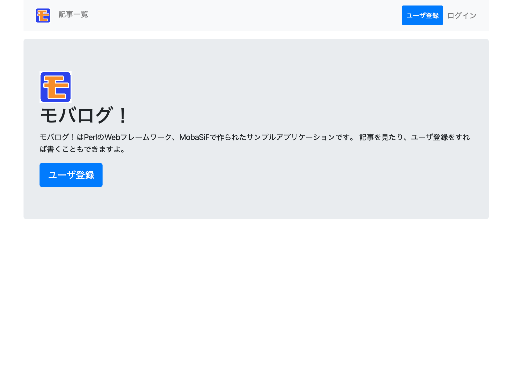
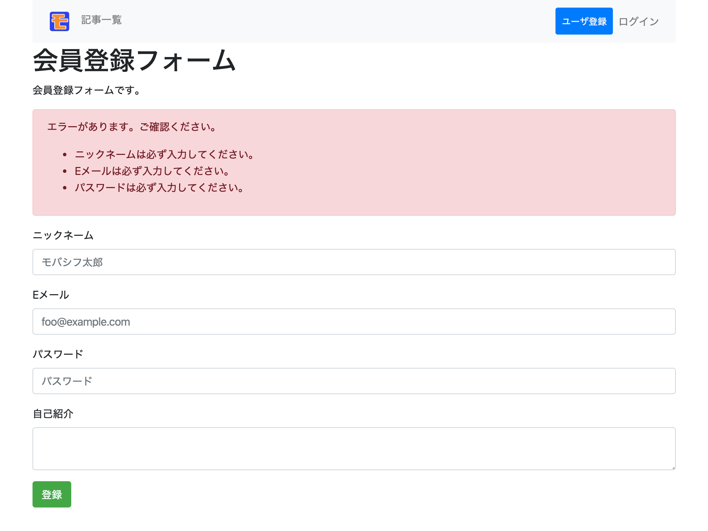
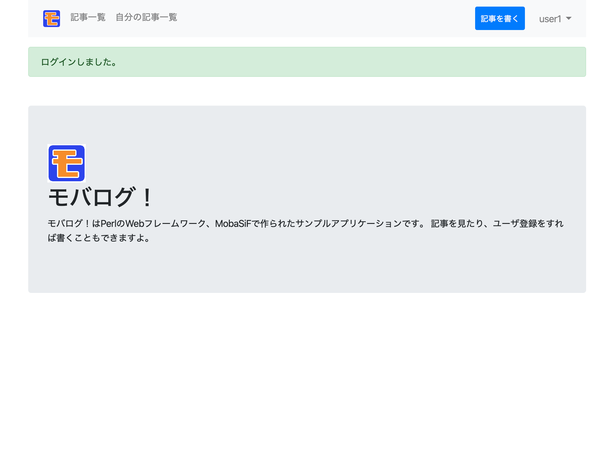
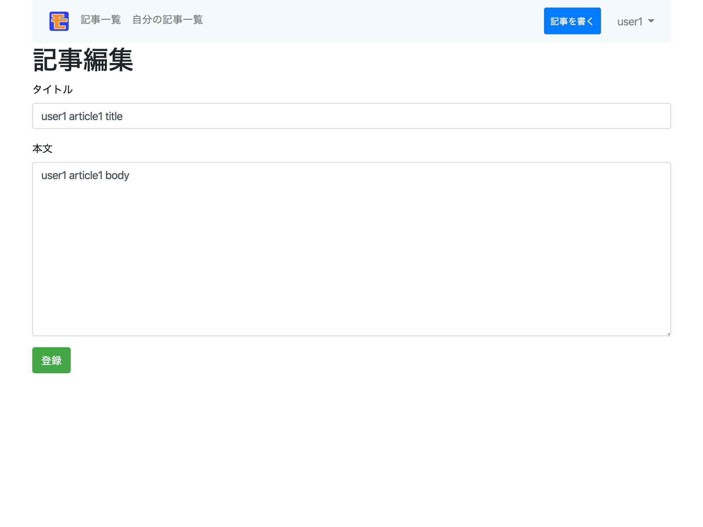
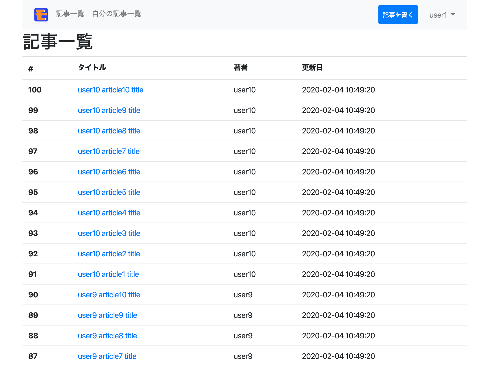

# サンプルアプリケーション「モバログ！」

一般的なWebアプリケーションの一般的と思われる、情報の参照、会員登録、ログイン・ログアウト、会員のみの情報登録が含まれるものをと考え、記事管理アプリケーション、「モバログ！」を作成しました。

ソースは[こちら](https://github.com/ken1flan/mobasif_sample)で管理しています。
[https://github.com/ken1flan/mobasif_sample](https://github.com/ken1flan/mobasif_sample)

## 前提条件

Docker Composeが使えること

## インストール

リポジトリをクローンして、docker-composeで起動後、セットアップスクリプトを実行するだけでできます。

```console
$ git clone git@github.com:ken1flan/mobasif_sample.git
$ docker-compose up
$ docker-compose exec mobasif /usr/local/lib/mobalog/bin/setup.sh
```

ブラウザで http://localhost にアクセスすると、モバログのトップページが見られます。



## 機能詳細

よくあるブログアプリケーションの基本的な機能のみを持っています。

- 会員登録
- ログイン、ログアウト
- 自分の記事の一覧、詳細、作成、編集、削除
- 記事の一覧、詳細

### 会員登録

ニックネーム、メールアドレス、自己紹介を記入して、会員登録ができます。
通常、メールアドレスを登録したあとにそのメールアドレスに招待メールが届き、その後登録するというのがよくあるパターンですが、そこまでやっていません。



### ログイン、ログアウト

メールアドレスとパスワードを使ってログインができます。
ログインした状態で、ナビゲーションバー右上の名前をクリックすると、ログアウトリンクがあり、ログアウトできます。



### 自分の記事の一覧、詳細、作成、編集、削除

ログインしていれば、記事を書くことができます。
また、自分の記事一覧を見たり、そこから編集や削除を行えます。



### 記事の一覧、詳細

ログイン有無に関わらず、モバログ！に寄稿されている記事を参照できます。


