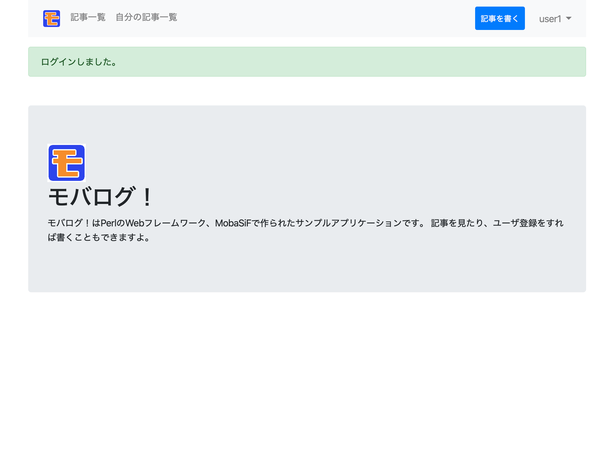

# フラッシュメッセージ

ログインの処理を書いていて、「ログインできました」のようなメッセージをログイン完了画面ではなくて、普通のページの上部に簡易に表示させるほうがシュッとしていてよいと思ったので、用意しました。
動作は[RailsのFlash](https://railsguides.jp/action_controller_overview.html#flash)を参考にしています。



フラッシュメッセージを管理するFlashというモジュールを作ります。
任意の場所でメッセージ本文とタイプを指定して保存するset()と、
設定されたフラッシュメッセージを取得するget()と、
設定されたメッセージを空にするclear()があります。

```perl
# pm/Flash.pm
package Flash;
  # :
  # (省略)
  # :
sub set {
  my ($message, $type) = @_;
  my $out_message = Encode::from_to($message, 'euc-jp', 'shiftjis');

  $_::S->param('flash_message', $message);
  $_::S->param('flash_type', $type);
}

sub get {
  return ($_::S->param('flash_message'), $_::S->param('flash_type'));
}

sub clear {
	$_::S->clear(['flash_message', 'flash_type']);
}
```

任意の場所でFlash::set()で設定したら、HTMLの生成時にFlash::get()でフラッシュメッセージを取得、HTML内で利用できるハッシュに登録したあと、内容をFlash::clear()で片付けています。

```perl
# pm/HTMLTemplate.pm
package HTMLTemplate;
  # :
  # (省略)
  # :
sub insert {
	my ($name, $rhParams, $rhParams2) = @_;
  # :
  # (省略)
  # :
	# フラッシュメッセージ
	($rhParams2->{FLASH_MESSAGE}, $rhParams2->{FLASH_TYPE}) = Flash::get();
	Flash::clear();

	# テンプレート処理

	# my $type = lc($ENV{MB_CARRIER_UA});
  my $type = 'p';
	my $html = MTemplate::insert(
		"$_::HTML_BIN_DIR/_system/$name.bin.$type",
			$rhParams, $rhParams2, $_::DEFAULT_CONFIG);

	return($html);
}
  # :
  # (省略)
  # :
```

今回の場合はナビゲーションバーの直下にフラッシュメッセージを配置しました。

```html
<!-- template/inc_html.txt -->
    :
    (省略)
    :
$INCDEF:navbar$
    :
    (省略)
    :
$ if (FLASH_MESSAGE) { $
  <div class="row py-3">
    <div class="col">
      <div class="alert alert-$=h:FLASH_TYPE$">
        $=h:FLASH_MESSAGE$
      </div>
    </div>
  </div>
$ } $
$/INCDEF$
    :
    (省略)
    :
```
